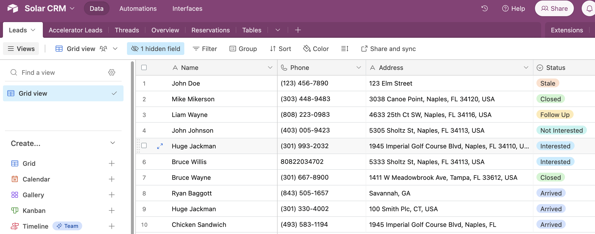

# Solar Lead Gen Assistant

## Summary
An AI-powered lead-generation virtual assistant for solar companies deployed on a website.

It is able to answer questions on the solar companies' business data and documents, calculate solar savings using external APIs, and capture the leads at the end of the conversation updating the data in the company's CRM.

## Demo

*The chat widget to talk to assistant displayed on the website*

*Introduction to the conversation with the assistant*

*The assistant able to answer a question using its knowledge base about the company*

*The assistant consuming the customer's data in order to calculate solar savings*

*Snippet of the solar savings report generated using the Google APIs (calculate solar coverage and savings analysis for their location and current bill)*

*The assistant following the procedure of trying to capture the lead for later conversion*

*The assistant successfully adding the lead's data to the company's CRM in Airtable*

